# Sandboxed Programmatic Tool Calling

A self-hosted implementation of [Anthropic's Programmatic Tool Calling](https://docs.anthropic.com/en/docs/build-with-claude/tool-use/computer-use#programmatic-tool-calling) with two execution modes:
- **Docker Sandbox** - Secure, isolated code execution for production
- **Local Sandbox** - Fast, no-Docker execution for development/testing

## Why Programmatic Tool Calling?

| Feature | Traditional Tool Use | Programmatic Tool Calling |
|---------|---------------------|---------------------------|
| Multi-tool latency | N model round-trips | 1 model round-trip |
| Token consumption | All results enter context | Only final output enters context |
| Data processing | Model processes data | Code processes data (more efficient) |
| Conditional logic | Each step needs model decision | Code handles automatically |

Instead of Claude making separate API calls for each tool, it generates Python code that orchestrates multiple tool calls, loops, and conditional logic—all executed in a single sandbox session.

## Features

- **Docker Sandbox Execution**: Secure, isolated code execution with network disabled, read-only filesystem, and resource limits
- **Local Sandbox Execution**: Fast, no-Docker execution for development/testing (same API as Docker version)
- **IPC Tool Calling**: Tools called from sandbox via stdin/stdout protocol, executed by host process
- **Session Reuse**: State persistence between executions (both Docker and Local modes)
- **Flexible Tool Registration**: Decorator-based API with automatic JSON schema generation
- **Bedrock & Anthropic API Support**: Works with both AWS Bedrock and direct Anthropic API

## Installation

```bash
# Clone the repository
git clone git@github.com:xiehust/claude_ptc.git
cd claude_ptc

# Install dependencies
pip install -r requirements.txt

# For Docker sandbox (optional - only needed for Docker mode)
docker info
```

### Requirements

- Python 3.11+
- Docker (optional - only for Docker sandbox mode)
- AWS credentials (for Bedrock) or Anthropic API key

## Quick Start

### Basic Usage

```python
from sandboxed_ptc import ToolRegistry, SandboxExecutor, SandboxConfig

# 1. Create tool registry
registry = ToolRegistry()

# 2. Register tools
@registry.register(
    description="Query the sales database",
    output_description="Returns list of sales records"
)
def query_sales(region: str, quarter: str) -> list[dict]:
    # Your implementation here
    return [{"region": region, "quarter": quarter, "revenue": 50000}]

# 3. Create sandbox executor
config = SandboxConfig(
    memory_limit="256m",
    timeout_seconds=60.0,
    network_disabled=True,
)
executor = SandboxExecutor(registry, config)

# 4. Execute code in sandbox
code = """
data = await query_sales(region="East", quarter="Q4")
print(f"Revenue: ${data[0]['revenue']:,}")
"""
result, session_id = await executor.execute(code)
print(result.stdout)  # Output: Revenue: $50,000
```

### With Session Reuse (Docker)

```python
config = SandboxConfig(
    enable_session_reuse=True,
    session_timeout_seconds=270.0,  # 4.5 minutes (matches official PTC)
)
executor = SandboxExecutor(registry, config)

# First execution - creates new session
result, session_id = await executor.execute("x = 10", reuse_session=True)

# Subsequent executions - reuse container, state persists
result, session_id = await executor.execute("print(x + 5)", session_id=session_id)
# Output: 15
```

### Local Sandbox (No Docker)

For development/testing or environments without Docker:

```python
from sandboxed_ptc import LocalSandboxExecutor, LocalSandboxConfig, ToolRegistry

# Same registration pattern
registry = ToolRegistry()

@registry.register(description="Add two numbers")
def add(a: int, b: int) -> int:
    return a + b

# Use LocalSandboxConfig instead of SandboxConfig
config = LocalSandboxConfig(
    timeout_seconds=60.0,
    enable_session_reuse=True,
)
executor = LocalSandboxExecutor(registry, config)

# Same API as SandboxExecutor
result, session_id = await executor.execute("x = 10", reuse_session=True)
result, session_id = await executor.execute("print(x + 5)", session_id=session_id)
# Output: 15
```

> **Warning**: Local sandbox provides NO security isolation. Only use with trusted code.

## Running Examples

```bash
# Configure AWS credentials (for Bedrock)
aws configure

# Docker sandbox example (requires Docker)
python examples/bedrock_docker_agent_example.py

# Local sandbox example (no Docker required)
python examples/local_agent_example.py

# Common options (both examples support these)
python examples/local_agent_example.py -i              # Interactive mode
python examples/local_agent_example.py --session-reuse # Session reuse
python examples/local_agent_example.py --low-level     # Low-level API demo
python examples/local_agent_example.py -v              # Verbose logging
python examples/local_agent_example.py --no-viz        # Disable visualization
```

## Architecture

```
┌─────────────────────────────────────────────────────────────┐
│                    User Application                          │
└─────────────────────────────────────────────────────────────┘
                              │
                              ▼
┌─────────────────────────────────────────────────────────────┐
│              ProgrammaticToolOrchestrator                    │
│  • Builds system prompt with tool documentation              │
│  • Manages conversation history                              │
│  • Handles tool_use loop with Claude API                     │
└─────────────────────────────────────────────────────────────┘
                              │
              ┌───────────────┴───────────────┐
              ▼                               ▼
┌─────────────────────────┐     ┌─────────────────────────────┐
│      Claude API         │     │     Sandbox Executor        │
│  (Bedrock/Anthropic)    │     │  (choose one)               │
└─────────────────────────┘     └─────────────────────────────┘
                                       │           │
                          ┌────────────┘           └────────────┐
                          ▼                                     ▼
            ┌─────────────────────────┐       ┌─────────────────────────┐
            │    SandboxExecutor      │       │  LocalSandboxExecutor   │
            │    (Docker mode)        │       │  (No Docker mode)       │
            │  • Docker containers    │       │  • Local Python exec    │
            │  • IPC communication    │       │  • Direct tool calls    │
            │  • Full isolation       │       │  • No isolation         │
            │  • Session reuse        │       │  • Session reuse        │
            └─────────────────────────┘       └─────────────────────────┘
                          │                                     │
                          └──────────────┬──────────────────────┘
                                         ▼
                          ┌─────────────────────────────┐
                          │       ToolRegistry          │
                          │  • Tool definitions         │
                          │  • Schema management        │
                          │  • Function execution       │
                          └─────────────────────────────┘
```

### IPC Protocol

Communication between host and Docker container:

| Direction | Channel | Message Format |
|-----------|---------|----------------|
| Container → Host | stderr | `__PTC_TOOL_CALL__{...}__PTC_END_CALL__` |
| Host → Container | stdin | `__PTC_TOOL_RESULT__{...}__PTC_END_RESULT__` |
| Container → Host | stdout | `__PTC_OUTPUT__{...}__PTC_END_OUTPUT__` |

### Security

Docker containers run with:
- `network_disabled: true` - No network access
- `read_only: true` - Read-only filesystem
- Non-root user (`sandbox`)
- `cap_drop: [ALL]` - All capabilities dropped
- `security_opt: [no-new-privileges]`
- Memory limit: 256MB (configurable)
- CPU quota: 50% (configurable)

## Project Structure

```
claude_ptc/
├── sandboxed_ptc/           # Core library
│   ├── __init__.py          # Public API exports
│   ├── sandbox.py           # Docker execution, IPC, sessions
│   ├── local_sandbox.py     # Local execution (no Docker)
│   ├── tool_registry.py     # Tool registration & schemas
│   ├── orchestrator.py      # Claude API coordination
│   └── exceptions.py        # Custom exceptions
├── examples/
│   ├── bedrock_docker_agent_example.py  # Full agent (Docker)
│   ├── local_agent_example.py           # Full agent (no Docker)
│   └── basic_usage.py                   # Minimal example
├── utils/
│   ├── team_expense_api.py  # Mock API for examples
│   └── visualize.py         # Response visualization
├── Dockerfile               # Sandbox container image
├── requirements.txt         # Python dependencies
└── ARCHITECTURE.md          # Detailed design docs
```

## Configuration

### SandboxConfig Options (Docker mode)

| Option | Default | Description |
|--------|---------|-------------|
| `image` | `python:3.11-slim` | Base Docker image |
| `memory_limit` | `256m` | Container memory limit |
| `cpu_quota` | `50000` | CPU quota (50% of one CPU) |
| `timeout_seconds` | `60.0` | Execution timeout |
| `network_disabled` | `True` | Disable network access |
| `read_only` | `True` | Read-only filesystem |
| `enable_session_reuse` | `True` | Enable container reuse |
| `session_timeout_seconds` | `270.0` | Session expiry (4.5 min) |

### LocalSandboxConfig Options (No Docker mode)

| Option | Default | Description |
|--------|---------|-------------|
| `timeout_seconds` | `60.0` | Execution timeout |
| `max_output_size` | `100000` | Max captured output chars |
| `enable_session_reuse` | `True` | Enable state persistence |
| `session_timeout_seconds` | `270.0` | Session expiry (4.5 min) |

## Comparison with Official PTC

| Feature | Official Anthropic PTC | Docker Sandbox | Local Sandbox |
|---------|----------------------|----------------|---------------|
| Sandbox environment | Anthropic-hosted | Self-hosted Docker | Local Python |
| Security isolation | Full | Full | None |
| Control | Limited | Full | Full |
| Custom dependencies | Not supported | Fully supported | Fully supported |
| Network access | Restricted | Configurable | Not restricted |
| Startup time | Fast | ~1-2s | Instant |
| Debugging | Limited | Full access | Full access |
| Session persistence | Supported | Supported | Supported |
| Cost | Per-use billing | Local resources | Local resources |
| Docker required | N/A | Yes | No |


## Official PTC flow
### Standard

```mermaid
---
config:
  theme: redux-color
---

sequenceDiagram
    participant Client
    participant Bedrock_Proxy
    participant Container as 代码执行容器
    participant User_Tools as 用户工具

    rect rgb(240, 255, 240)
        Note over Client,User_Tools: 场景：查询3个区域的销售数据并分析
    end

    Client->>Bedrock_Proxy: 1️⃣ 发送请求 + allowed_callers配置
    
    activate Bedrock_Proxy
    Bedrock_Proxy->>Bedrock_Proxy: 分析任务，生成Python代码
    Bedrock_Proxy->>Container: 2️⃣ 创建容器，执行代码
    deactivate Bedrock_Proxy
    
    activate Container
    Note over Container: regions = ["West", "East", "Central"]<br/>for region in regions:<br/>    data = await query_database(region)
    deactivate Container
    
    rect rgb(255, 250, 230)
        Note over Client,User_Tools: 🔄循环：容器内多次工具调用
        
        loop 每个区域查询
            Container->>Bedrock_Proxy: 3️⃣ 暂停容器，请求工具
            Bedrock_Proxy->>Client: 4️⃣ 返回 tool_use
            Client->>User_Tools: 5️⃣ 执行工具
            User_Tools-->>Client: 返回数据
            Client->>Bedrock_Proxy: 6️⃣ 发送 tool_result
            Bedrock_Proxy->>Container: 7️⃣ 注入结果，继续执行
            Note over Container: 在代码中处理数据<br/>（过滤/聚合/计算）<br/>❗数据不进入模型上下文
        end
    end
    
    activate Container
    Note over Container: 代码执行完成<br/>top = max(results)<br/>print(f"最高: {top}")
    Container->>Bedrock_Proxy: 8️⃣ 返回执行结果 (stdout)
    deactivate Container
    
    activate Bedrock_Proxy
    Bedrock_Proxy->>Bedrock_Proxy: 基于代码输出生成响应
    Bedrock_Proxy->>Client: 9️⃣ 返回最终响应
    deactivate Bedrock_Proxy

    rect rgb(200, 255, 200)
        Note over Client,User_Tools: ✅ 1次模型推理 | ✅ 只有摘要进入上下文 | ✅ 节省85% tokens
    end
```

### Concised

```mermaid
sequenceDiagram
    participant Client
    participant Claude_API
    participant Container as 代码容器
    participant Tools as 工具

    Client->>Claude_API: ① 请求 + allowed_callers
    Claude_API->>Container: ② 生成并执行Python代码
    
    rect rgb(255, 250, 200)
        loop 代码中的每个工具调用
            Container->>Client: ③ tool_use (容器暂停)
            Client->>Tools: 执行工具
            Tools-->>Client: 返回结果
            Client->>Container: ④ tool_result (容器继续)
        end
    end
    
    Container->>Claude_API: ⑤ 代码输出 (摘要)
    Claude_API->>Client: 最终响应

    Note over Client,Tools: 🔑 关键：所有数据在容器内处理，只返回摘要
```



## License

MIT
