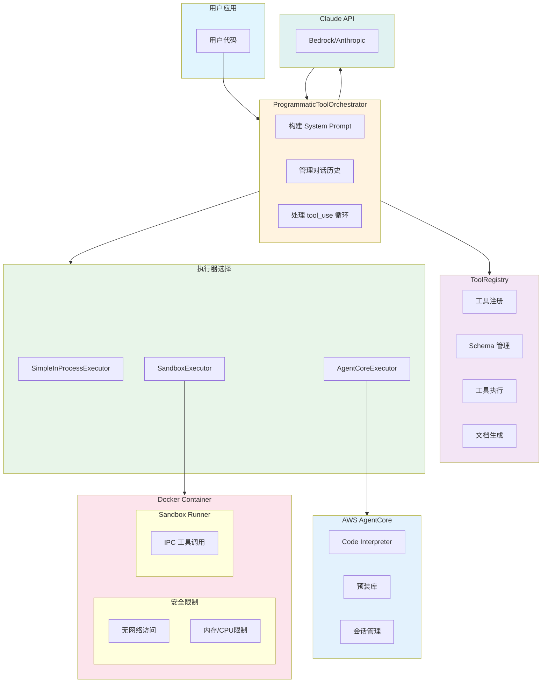
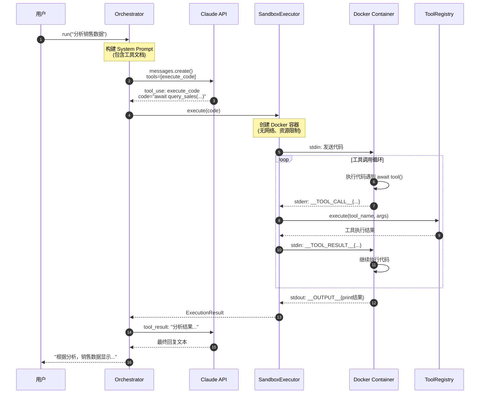
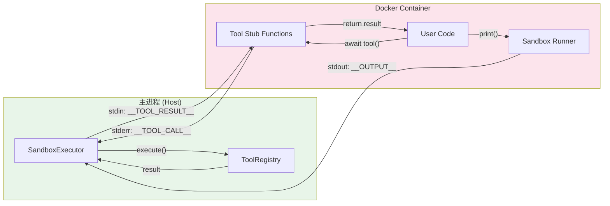
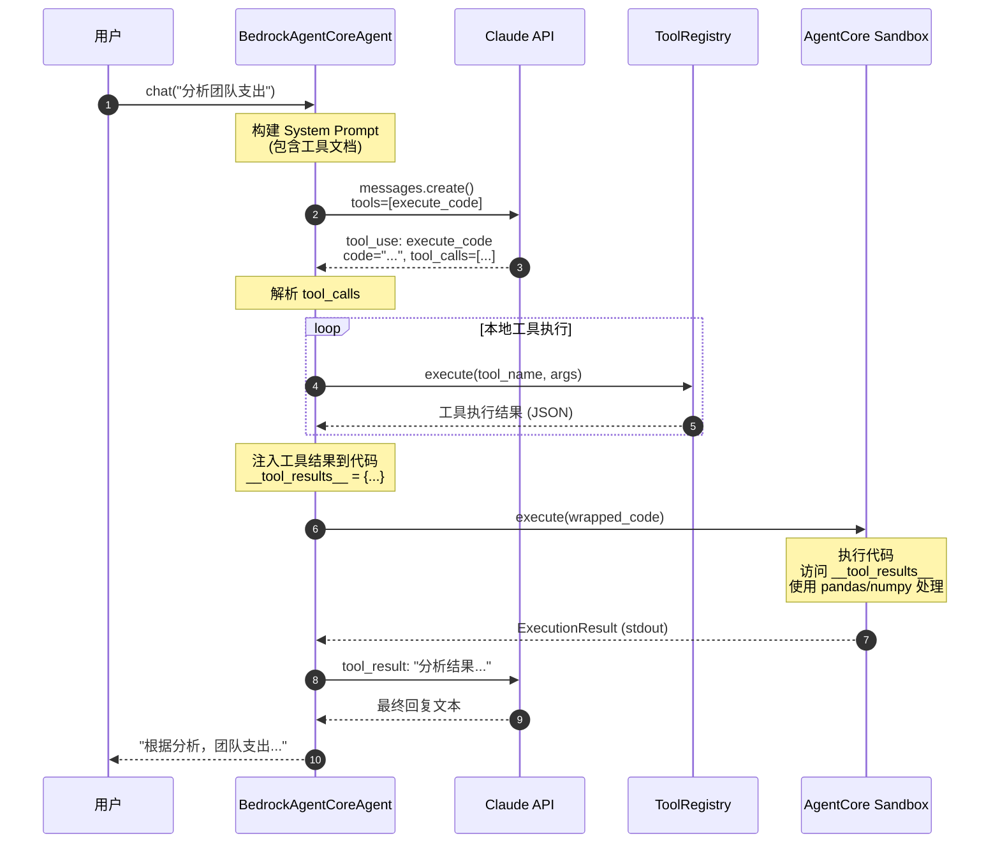
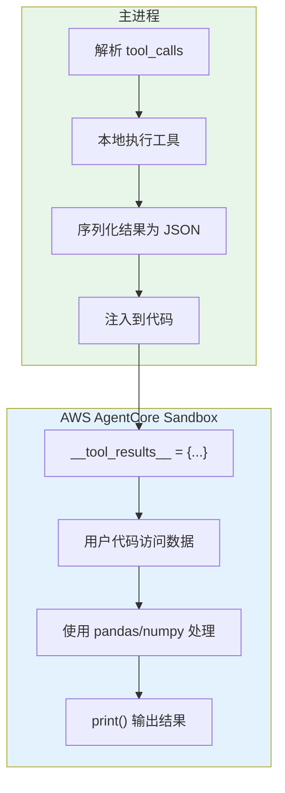
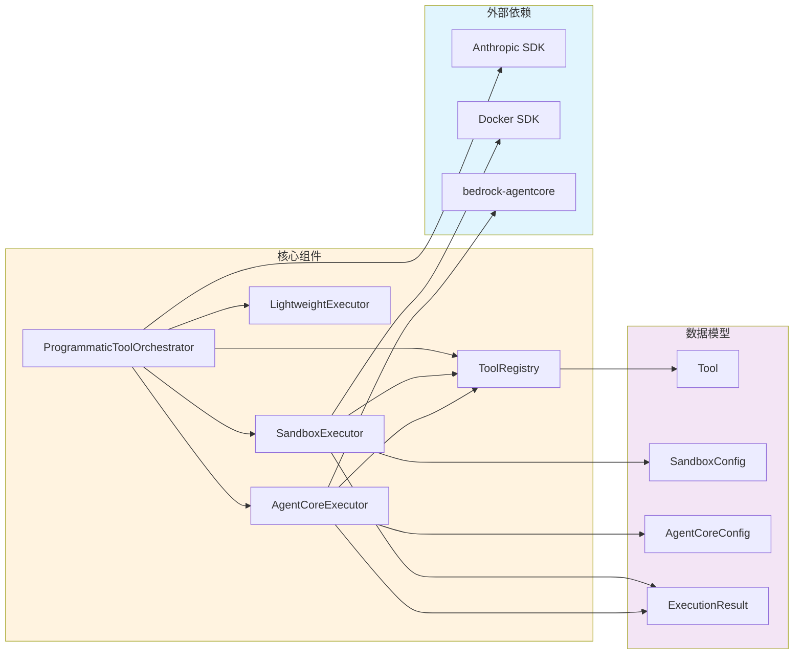

# Sandboxed Programmatic Tool Calling 架构设计

## 概述

本项目实现了一个类似 Anthropic 官方 Programmatic Tool Calling 的机制，使用 Docker 容器沙箱执行环境，提供安全隔离、灵活的部署选项和完全的控制权。

核心执行器：
- **SandboxExecutor (Docker)**: Docker 容器沙箱，提供安全隔离的代码执行环境

## 核心价值

与传统 Tool Use 相比，Programmatic Tool Calling 的优势：

| 特性 | 传统 Tool Use | Programmatic Tool Calling |
|------|--------------|---------------------------|
| 多工具调用延迟 | N 次模型往返 | 1 次模型往返 |
| Token 消耗 | 所有结果进入上下文 | 只有最终输出进入上下文 |
| 数据处理 | 模型处理 | 代码处理（更高效） |
| 条件逻辑 | 每步需要模型决策 | 代码自动处理 |

## 执行器对比

| 特性 | SimpleInProcessExecutor | SandboxExecutor (Docker) | AgentCoreExecutor (AWS) |
|------|------------------------|--------------------------|------------------------|
| 安全隔离 | 无 | 容器级隔离 | 云端隔离 |
| 工具调用方式 | 直接调用 | IPC 通信 | 结果注入 |
| 预装依赖 | 无 | 自定义 | 丰富的数据科学库 |
| 启动延迟 | 无 | 容器启动 | 会话创建 |
| 会话持久化 | 无 | 无 | 支持 |
| 文件操作 | 无 | 有限 | 完整支持 |
| 适用场景 | 开发调试 | 本地生产 | 云端生产 |
| 网络访问 | 无限制 | 可禁用 | AWS 托管 |
| 成本 | 免费 | 本地资源 | AWS 计费 |

## 架构图 (Mermaid)

### 整体系统架构



### 请求处理时序图



### IPC 通信流程



### AgentCore 执行时序图



### AgentCore 工具结果注入流程



### 组件依赖关系



### 传统 Tool Use vs Programmatic Tool Calling

```mermaid
graph TB
    subgraph Traditional["传统 Tool Use"]
        T1[用户请求] --> T2[Claude 调用 tool_1]
        T2 --> T3[返回结果 → 进入上下文]
        T3 --> T4[Claude 调用 tool_2]
        T4 --> T5[返回结果 → 进入上下文]
        T5 --> T6[Claude 调用 tool_3]
        T6 --> T7[返回结果 → 进入上下文]
        T7 --> T8[Claude 生成回复]
    end

    subgraph Programmatic["Programmatic Tool Calling"]
        P1[用户请求] --> P2[Claude 生成代码]
        P2 --> P3[execute_code]

        subgraph CodeExec["代码执行 (不进入上下文)"]
            P3 --> P4[await tool_1]
            P4 --> P5[await tool_2]
            P5 --> P6[await tool_3]
            P6 --> P7["print(聚合结果)"]
        end

        P7 --> P8[只有 print 输出返回]
        P8 --> P9[Claude 生成回复]
    end

    style Traditional fill:#ffebee
    style Programmatic fill:#e8f5e9
    style CodeExec fill:#fff8e1
```



## 执行流程

### 1. 初始化阶段

```
用户注册工具
     │
     ▼
┌─────────────────┐
│ ToolRegistry    │
│ - 存储工具函数   │
│ - 生成 Schema   │
│ - 生成文档      │
└─────────────────┘
```

### 2. 请求处理流程

```
用户请求
     │
     ▼
┌─────────────────────────────────────────────────────────────┐
│ Orchestrator.run()                                          │
│                                                             │
│  1. 构建 System Prompt（包含工具文档）                       │
│  2. 添加 execute_code 工具定义                              │
│  3. 调用 Claude API                                         │
└─────────────────────────────────────────────────────────────┘
     │
     ▼
┌─────────────────────────────────────────────────────────────┐
│ Claude 决定使用 execute_code 工具                            │
│                                                             │
│  返回：                                                      │
│  {                                                          │
│    "type": "tool_use",                                      │
│    "name": "execute_code",                                  │
│    "input": {                                               │
│      "code": "result = await query_database(...)\n..."      │
│    }                                                        │
│  }                                                          │
└─────────────────────────────────────────────────────────────┘
     │
     ▼
┌─────────────────────────────────────────────────────────────┐
│ SandboxExecutor.execute()                                   │
│                                                             │
│  1. 创建 Docker 容器（无网络、资源限制）                      │
│  2. 注入 runner.py 脚本                                     │
│  3. 通过 stdin 发送代码                                      │
│  4. 监听 stdout/stderr                                      │
└─────────────────────────────────────────────────────────────┘
     │
     ▼
┌─────────────────────────────────────────────────────────────┐
│ Container 内部执行                                           │
│                                                             │
│  用户代码:                                                   │
│  ┌────────────────────────────────────────────────────┐     │
│  │ result = await query_database(sql="SELECT ...")    │     │
│  │          ▲                                         │     │
│  │          │ 调用 stub 函数                          │     │
│  │          ▼                                         │     │
│  │ ┌────────────────────────────────────────────┐    │     │
│  │ │ Stub: 发送 IPC 请求到 stderr                │    │     │
│  │ │       等待 stdin 返回结果                   │    │     │
│  │ └────────────────────────────────────────────┘    │     │
│  └────────────────────────────────────────────────────┘     │
└─────────────────────────────────────────────────────────────┘
     │                            ▲
     │ IPC: 工具调用请求           │ IPC: 工具调用结果
     ▼                            │
┌─────────────────────────────────────────────────────────────┐
│ 主进程 (SandboxExecutor)                                    │
│                                                             │
│  1. 解析工具调用请求                                         │
│  2. 调用 ToolRegistry.execute()                             │
│  3. 将结果发送回容器                                         │
└─────────────────────────────────────────────────────────────┘
     │
     ▼
┌─────────────────────────────────────────────────────────────┐
│ 代码执行完成                                                 │
│                                                             │
│  返回最终 print 输出到 Orchestrator                          │
└─────────────────────────────────────────────────────────────┘
     │
     ▼
┌─────────────────────────────────────────────────────────────┐
│ Orchestrator 将结果返回给 Claude                             │
│                                                             │
│  tool_result: "分析完成。Top 5 客户: ..."                    │
└─────────────────────────────────────────────────────────────┘
     │
     ▼
┌─────────────────────────────────────────────────────────────┐
│ Claude 生成最终回复                                          │
│                                                             │
│  "根据分析，您的销售数据显示..."                              │
└─────────────────────────────────────────────────────────────┘
```

## IPC 协议

### 工具调用请求（Container → Host）

通过 stderr 发送，避免与 print 输出混淆：

```
__PTC_TOOL_CALL__{"call_id": "uuid", "tool_name": "query_database", "arguments": {"sql": "..."}}__PTC_END_CALL__
```

### 工具调用响应（Host → Container）

通过 stdin 发送：

```
__PTC_TOOL_RESULT__{"call_id": "uuid", "result": [...], "error": null}__PTC_END_RESULT__
```

### 最终输出（Container → Host）

通过 stdout 发送：

```
__PTC_OUTPUT__{"success": true, "output": "...", "error": null}__PTC_END_OUTPUT__
```

## 安全设计

### Docker 容器安全措施

```yaml
security:
  network_disabled: true          # 禁用网络
  read_only: true                 # 只读文件系统
  user: sandbox (non-root)        # 非特权用户
  cap_drop: [ALL]                 # 移除所有 capabilities
  security_opt: [no-new-privileges]  # 禁止提权
  mem_limit: 256m                 # 内存限制
  cpu_quota: 50000                # CPU 限制 (50%)
```

### 代码验证（轻量级执行器）

```python
# 禁止的操作
FORBIDDEN = {
    ast.Import,        # import 语句
    ast.ImportFrom,    # from ... import 语句
}

# 禁止的属性访问
FORBIDDEN_ATTRIBUTES = {
    '__class__', '__bases__', '__subclasses__',
    '__code__', '__globals__', '__builtins__'
}
```

## 组件详解

### ToolRegistry

负责工具的注册、管理和执行：

```python
@registry.register(
    description="查询数据库",
    output_description="返回 list[dict]",
    allowed_callers=[ToolCallerType.CODE_EXECUTION]
)
def query_database(sql: str) -> list[dict]:
    return db.execute(sql)
```

特性：
- 自动从函数签名推断 JSON Schema
- 支持指定调用者类型（直接调用 / 代码执行）
- 生成工具文档用于 System Prompt

### SandboxExecutor

负责在 Docker 容器中安全执行代码：

特性：
- 动态生成 runner 脚本
- 处理 IPC 通信
- 工具调用拦截和结果注入
- 超时控制
- 支持自定义镜像构建

### ProgrammaticToolOrchestrator

负责协调 Claude API 和沙箱执行：

特性：
- 构建优化的 System Prompt
- 处理 tool_use 循环
- 支持流式响应
- 对话历史管理

### AgentCoreExecutor

负责在 AWS Bedrock AgentCore 云端沙箱中执行代码：

```python
from sandboxed_ptc import AgentCoreExecutor, AgentCoreConfig

config = AgentCoreConfig(
    region="us-west-2",
    timeout_seconds=60.0,
    auto_create_session=True,
    persist_session=True,
    language="python"
)

executor = AgentCoreExecutor(tool_registry, config)

# 基本执行
result = await executor.execute("import pandas as pd; print(pd.__version__)")

# 带工具结果注入的执行
result = await executor.execute_with_tool_results(
    code='''
    import json
    team = json.loads(__tool_results__["get_team_members"])
    print(f"Team size: {len(team)}")
    ''',
    tool_results={"get_team_members": team_json_data}
)
```

特性：
- 云端安全隔离执行环境
- 预装丰富的数据科学库（pandas, numpy, torch, scikit-learn 等）
- 会话状态持久化
- 文件读写操作支持
- 工具结果注入机制
- Shell 命令执行

AgentCore 预装库：
- 数据分析: pandas, numpy, scipy, statsmodels
- 可视化: matplotlib, plotly, seaborn, bokeh
- 机器学习: scikit-learn, torch, xgboost
- 文件处理: openpyxl, PyPDF2, python-docx
- 网络请求: requests, httpx, beautifulsoup4

## 使用方式

### 基本使用

```python
from sandboxed_ptc import ProgrammaticToolOrchestrator

orchestrator = ProgrammaticToolOrchestrator(api_key="...")

@orchestrator.register_tool(
    description="查询销售数据库"
)
def query_sales(region: str) -> list[dict]:
    return db.query(f"SELECT * FROM sales WHERE region='{region}'")

result = await orchestrator.run(
    "分析 East、West、Central 三个区域的销售数据"
)
```

### Claude 生成的代码示例

```python
# Claude 会生成类似这样的代码：
regions = ["East", "West", "Central"]
results = {}

for region in regions:
    data = await query_sales(region=region)
    total = sum(item["revenue"] for item in data)
    results[region] = total

# 找出最高收入区域
top_region = max(results.items(), key=lambda x: x[1])
print(f"最高收入区域: {top_region[0]}, 收入: ${top_region[1]:,}")
```

### AgentCore 使用示例

```python
from sandboxed_ptc import ToolRegistry, AgentCoreExecutor, AgentCoreConfig

# 创建配置
config = AgentCoreConfig(
    region="us-west-2",
    timeout_seconds=60.0,
    persist_session=True
)

# 创建执行器
registry = ToolRegistry()
executor = AgentCoreExecutor(registry, config)

# 使用上下文管理器管理会话
async with executor:
    # 简单执行
    result = await executor.execute('''
import pandas as pd
import numpy as np

data = pd.DataFrame({
    'name': ['Alice', 'Bob', 'Charlie'],
    'salary': [50000, 60000, 55000]
})
print(data.describe())
''')
    print(result.stdout)

    # 带工具结果注入的执行
    tool_results = {
        "get_team_members": '[{"id": "E001", "name": "Alice"}, {"id": "E002", "name": "Bob"}]'
    }
    result = await executor.execute_with_tool_results(
        code='''
import json
import pandas as pd

team = json.loads(__tool_results__["get_team_members"])
df = pd.DataFrame(team)
print(f"Team members: {len(df)}")
print(df.to_string())
''',
        tool_results=tool_results
    )
```

### Agent 完整示例

```python
from examples.bedrock_agentcore_agent_example import BedrockAgentCoreAgent, AgentConfig

# 创建 Agent
config = AgentConfig(
    model="global.anthropic.claude-opus-4-5-20251101-v1:0",
    max_tokens=8192,
    max_iterations=15
)

async with BedrockAgentCoreAgent(config=config) as agent:
    # 发送请求
    response, input_tokens, output_tokens = await agent.chat(
        "分析 engineering 团队 Q3 的差旅支出情况，找出超预算的员工"
    )
    print(response)
```

## 与官方 Programmatic Tool Calling 对比

| 特性 | 官方方案 | Docker 沙箱 | AgentCore 沙箱 |
|------|---------|-------------|---------------|
| 沙箱环境 | Anthropic 托管 | 自托管 Docker | AWS 托管 |
| 控制权 | 有限 | 完全 | 部分 |
| 部署灵活性 | 受限 | 灵活 | AWS 限定 |
| 网络访问 | 受限 | 可配置 | AWS 托管 |
| 自定义依赖 | 不支持 | 完全支持 | 预装库 |
| 调试能力 | 有限 | 完全 | 部分 |
| 预装库 | 有限 | 自定义 | 丰富 |
| 会话持久化 | 支持 | 不支持 | 支持 |
| 成本 | 按使用计费 | 本地资源 | AWS 计费 |

## 官方 PTC 机制深度分析

> 参考文档: https://platform.claude.com/docs/en/agents-and-tools/tool-use/programmatic-tool-calling

### 官方 PTC 核心机制

官方 Programmatic Tool Calling 的执行流程：

```
Claude 写代码 → 代码执行遇到 await tool() → **暂停**执行 → 返回 tool_use →
你提供结果 → **继续**执行 → 最终 print 输出返回 Claude
```

关键特性：
1. **实时暂停/恢复**: 代码执行到工具调用时暂停，等待结果后继续
2. **中间结果不进入上下文**: 只有最终 print 输出进入 Claude 上下文
3. **支持动态调用**: 循环、条件判断中按需调用工具
4. **`allowed_callers` 字段**: 指定工具可被 `["direct"]` 或 `["code_execution_20250825"]` 调用

### Docker Sandbox vs AgentCore 与官方 PTC 的匹配度

| 特性 | 官方 PTC | Docker Sandbox | AgentCore |
|------|---------|---------------|-----------|
| **代码执行暂停/恢复** | ✅ 支持 | ✅ 支持 (IPC) | ❌ 不支持 |
| **实时工具调用** | ✅ await 后立即调用 | ✅ stderr→工具→stdin | ❌ 需预先执行 |
| **循环中动态调用** | ✅ 支持 | ✅ 支持 | ❌ 不支持 |
| **条件分支决定调用** | ✅ 支持 | ✅ 支持 | ❌ 不支持 |
| **中间结果隔离** | ✅ 不进上下文 | ✅ 不进上下文 | ✅ 不进上下文 |
| **容器会话复用** | ✅ 支持 | ✅ 支持 (v2) | ✅ 支持 |

### Docker Sandbox - 完全匹配官方模式

Docker Sandbox 的 IPC 机制与官方 PTC 的设计完全一致：

```python
# 官方文档示例 - Docker Sandbox 可完美支持
for region in regions:
    data = await query_database(f"SELECT * FROM sales WHERE region='{region}'")
    results[region] = sum(row["revenue"] for row in data)
print(f"Top region: {top_region}")
```

执行流程：
```
代码执行 → await query_database()
         → IPC: stderr 发送请求
         → 主进程执行工具
         → IPC: stdin 返回结果
         → 代码继续执行下一次循环
```

这正是官方文档中描述的 **"Self-managed sandboxed execution"** 模式：

> "Same approach from Claude's perspective, but code runs in a sandboxed container with security restrictions. If your tools require external resources, you'll need a protocol for executing tool calls outside the sandbox."

### AgentCore - 不匹配官方模式

AgentCore 由于无法实现代码执行中的暂停/恢复，采用了不同的设计：

```python
# AgentCore 模式 - 需要预先声明所有工具调用
{
    "code": "team = json.loads(__tool_results__['get_team_members'])...",
    "tool_calls": [{"tool_name": "get_team_members", "arguments": {...}}]
}
```

执行流程：
```
解析 tool_calls → 主进程预执行所有工具 → 注入结果到 __tool_results__ →
发送代码到 AgentCore → 执行（无法再调用工具）
```

**无法实现**官方示例中的动态循环调用：

```python
# ❌ AgentCore 无法支持此模式
for endpoint in endpoints:
    status = await check_health(endpoint)  # 无法实时调用
    if status == "healthy":
        print(f"Found healthy endpoint: {endpoint}")
        break  # 早期终止
```

### 官方文档定义的三种实现方式

| 方式 | 描述 | 我们的实现 | 匹配度 |
|------|------|-----------|--------|
| **Client-side direct** | 本地执行，无沙箱 | `SimpleInProcessExecutor` | ✅ 完全匹配 |
| **Self-managed sandbox** | 沙箱 + IPC 通信 | `SandboxExecutor` (Docker) | ✅ 完全匹配 |
| **Anthropic-managed** | 官方托管沙箱 | 无法复制 | N/A |

### 结论与选型建议

**Docker Sandbox 更符合官方 Programmatic Tool Calling**：

1. **架构一致**: IPC 暂停/恢复机制完全匹配官方设计
2. **功能完整**: 支持动态循环、条件分支、早期终止
3. **官方认可**: 文档明确提到 "Self-managed sandboxed execution" 是有效的替代方案

**AgentCore 适用场景**：

1. 工具调用**可预先确定**的场景
2. 需要**丰富预装库**进行数据处理（pandas, numpy, torch 等）
3. 需要**会话状态持久化**的场景
4. 更像是 "数据获取 + 高级数据处理" 而非真正的 PTC

**选型建议**：

```
┌─────────────────────────────────────────────────────────────────┐
│                        需要真正的 PTC？                          │
│                                                                 │
│    是（动态工具调用）          否（工具调用可预先确定）            │
│         │                              │                        │
│         ▼                              ▼                        │
│  ┌─────────────┐              ┌─────────────────┐               │
│  │Docker Sandbox│              │需要高级数据处理？│               │
│  └─────────────┘              └─────────────────┘               │
│                                   │         │                   │
│                                   是        否                   │
│                                   │         │                   │
│                                   ▼         ▼                   │
│                           ┌──────────┐ ┌──────────────────┐    │
│                           │AgentCore │ │SimpleInProcess   │    │
│                           └──────────┘ └──────────────────┘    │
└─────────────────────────────────────────────────────────────────┘
```

## Docker Sandbox 容器复用模式 (v2)

### 功能概述

Docker Sandbox 现在支持容器复用模式，与官方 Anthropic PTC 完全一致：

- **容器保持运行**：不再每次执行后销毁容器
- **状态持久化**：变量在多次代码执行间保持
- **会话超时**：默认 4.5 分钟（与官方一致），可配置
- **自动清理**：后台任务自动清理过期会话

### 使用方式

```python
from sandboxed_ptc import SandboxExecutor, SandboxConfig, ToolRegistry

# 配置启用会话复用
config = SandboxConfig(
    enable_session_reuse=True,
    session_timeout_seconds=270.0,  # 4.5 分钟
)

executor = SandboxExecutor(registry, config)

# 首次执行 - 创建新会话
result1, session_id = await executor.execute("x = 10", reuse_session=True)

# 复用会话 - 变量 x 仍然存在
result2, session_id = await executor.execute("print(x + 5)", session_id=session_id)
# 输出: 15

# 手动关闭会话
await executor.close_session(session_id)
```

### 会话管理 API

| 方法 | 说明 |
|------|------|
| `execute(code, session_id=None, reuse_session=False)` | 执行代码，支持会话复用 |
| `get_session(session_id)` | 获取会话信息 |
| `close_session(session_id)` | 关闭指定会话 |
| `close_all_sessions()` | 关闭所有会话 |
| `active_sessions` | 获取所有活跃会话信息 |
| `start_cleanup_task()` | 启动后台清理任务 |
| `stop_cleanup_task()` | 停止后台清理任务 |

### 会话生命周期

```
                    ┌─────────────────┐
                    │  创建新会话      │
                    │  (首次执行)      │
                    └────────┬────────┘
                             │
                             ▼
┌────────────────────────────────────────────────────────┐
│                    会话活跃期                           │
│                                                        │
│   ┌─────────┐     ┌─────────┐     ┌─────────┐        │
│   │ 执行 1  │ ──▶ │ 执行 2  │ ──▶ │ 执行 3  │        │
│   │ x = 10  │     │ y = x+5 │     │ print(y)│        │
│   └─────────┘     └─────────┘     └─────────┘        │
│        │               │               │              │
│        └───────────────┴───────────────┘              │
│                    状态保持                            │
│                                                        │
│   每次执行后刷新过期时间                                │
└────────────────────────────────────────────────────────┘
                             │
              ┌──────────────┴──────────────┐
              │                              │
              ▼                              ▼
     ┌────────────────┐            ┌────────────────┐
     │ 手动关闭        │            │ 自动过期清理    │
     │ close_session() │            │ (后台任务)      │
     └────────────────┘            └────────────────┘
```

### 配置选项

```python
@dataclass
class SandboxConfig:
    # ... 基础配置 ...

    # 会话复用配置
    session_timeout_seconds: float = 270.0   # 会话超时（默认 4.5 分钟）
    enable_session_reuse: bool = True        # 是否启用容器复用
    cleanup_interval_seconds: float = 60.0   # 清理检查间隔
```

## 扩展方向

1. **多语言支持**: 支持 JavaScript、Go 等语言的沙箱
2. ~~**持久化容器**: 复用容器减少启动延迟~~ ✅ 已实现
3. **分布式执行**: 支持远程沙箱集群
4. **监控告警**: 执行时间、资源使用监控
5. **审计日志**: 记录所有工具调用和代码执行

## 文件结构

```
sandboxed_ptc/
├── __init__.py              # 模块入口
├── exceptions.py            # 自定义异常
├── tool_registry.py         # 工具注册表
├── sandbox.py               # Docker 沙箱执行器
├── lightweight_executor.py  # 轻量级执行器（开发用）
├── agentcore_executor.py    # AWS AgentCore 执行器
└── orchestrator.py          # 主调度器

examples/
├── bedrock_agent_example.py           # Bedrock Agent 示例（进程内执行器）
└── bedrock_agentcore_agent_example.py # AgentCore Agent 示例

utils/
├── team_expense_api.py      # 模拟团队支出 API
├── code_interpreter.py      # Code Interpreter 参考实现
└── visualize.py             # 响应可视化工具

Dockerfile                   # Docker 沙箱镜像定义
ARCHITECTURE.md              # 本文档
```

## 快速开始

### 使用进程内执行器（开发调试）

```bash
python examples/bedrock_agent_example.py
python examples/bedrock_agent_example.py -i  # 交互模式
```

### 使用 AgentCore 执行器（生产推荐）

```bash
# 安装依赖
pip install anthropic bedrock-agentcore

# 配置 AWS 凭证
aws configure

# 运行示例
python examples/bedrock_agentcore_agent_example.py
python examples/bedrock_agentcore_agent_example.py -i       # 交互模式
python examples/bedrock_agentcore_agent_example.py --expense # 支出分析演示
```

